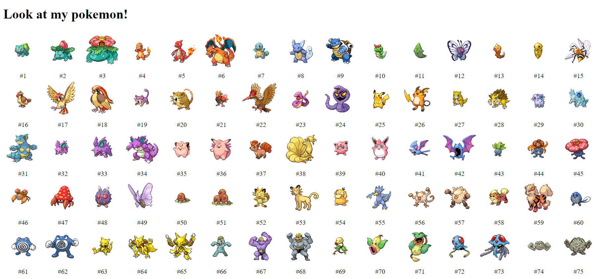
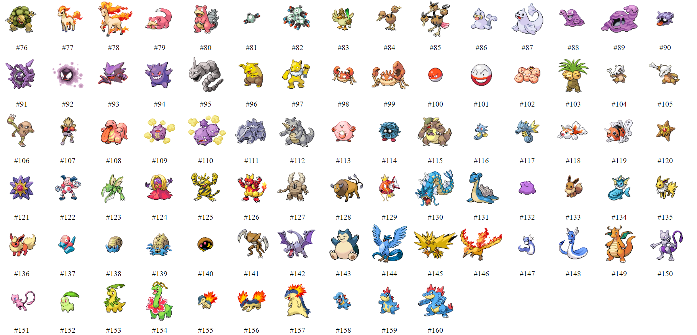

# Pokemon Sprites

This is my first simple practice on DOM manipulation and I used pokemon sprites for this practice.

 
 

 
 
[Link for the Pokemon Sprites used](https://raw.githubusercontent.com/PokeAPI/sprites/master/sprites/pokemon/)

